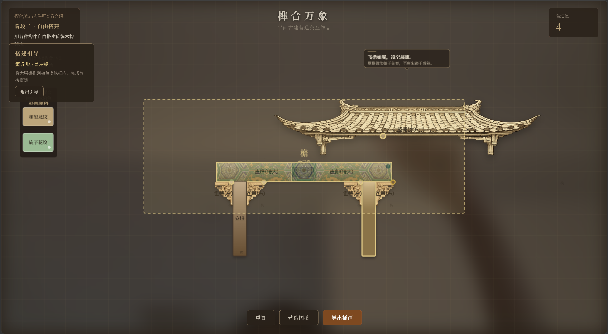

# 榫合万象

> 平面古建营造交互作品 —— 用手势拼榫卯、架梁柱、起飞檐



## 项目简介

「榫合万象」是一款基于手势识别的传统木构建筑交互搭建体验。玩家通过摄像头捕捉手部姿态，用食指与拇指捏合的方式拖拽构件，完成榫卯嵌合、立柱架梁、装雀替、盖屋檐等营造工序，感受中国传统木构建筑之美。

项目融合了 MediaPipe 实时手势识别、Canvas 2D 渲染、榫卯嵌合算法与传统建筑知识图谱，既是一个交互式数字作品，也是一次对传统营造技艺的数字化诠释。

## 功能特性

### 手势交互
- 基于 **MediaPipe Hands** 实现实时手部 21 关键点追踪
- 食指与拇指捏合即可拾取、拖拽、放下构件
- 手势光标实时跟随手部位置，捏合时有视觉反馈
- 无摄像头时自动回退到鼠标操作，兼容所有设备

### 两阶段流程

**阶段一 · 引导教学**
- 任务一：燕尾榫 × 燕尾卯嵌合 —— 学习燕尾榫"大头小尾、拉结牢固"的特性
- 任务二：直榫 × 直卯嵌合 —— 学习最基础的榫卯形式
- 任务三：立柱 —— 将柱子吸附到已拼接的梁上，完成柱梁节点
- 每完成一个任务自动解锁下一步，附带错误提示与容差引导

**阶段二 · 自由搭建**
- 提供多种尺寸的直榫直卯、立柱、雀替、屋檐等构件
- 可自由拼接、组合、移动已搭建的建筑
- **搭建引导模式**：5 步引导搭建一座完整传统牌楼
  1. 立两柱
  2. 拼接直榫直卯成横梁
  3. 将横梁架到柱顶
  4. 每根柱子顶端左右各装雀替（共 4 个，带自动吸附）
  5. 盖上大屋檐
- 引导完成后建筑保留在画布中，可整体拖动移动

### 榫卯嵌合系统
- 支持**燕尾榫**（梯形榫头，抗拉）和**直榫**（矩形榫头，承压）两种类型
- 基于连接点距离与旋转角度的**双容差判定**算法
- 嵌合时自动吸附对齐，配合动画过渡
- 嵌合后构件自动成组，可整体拖动

### 彩画装饰
- 营造值（分数）达标后解锁彩画颜料
- **和玺彩画**：最高等级，龙纹主题，金线勾勒
- **旋子彩画**：旋花状图案，等级次于和玺
- 拖拽颜料到已嵌合构件即可上色，花纹实时渲染
- 支持图案裁剪与重叠处理（直卯花纹覆盖直榫嵌合区）

### 构件图鉴
- 每个构件配有名称、类别、简介、文化注解与历史溯源
- 悬停构件即可查看传统文化知识
- 涵盖商周至明清的木构建筑演变脉络

### 其他功能
- **导出插画**：一键导出 SVG 格式的搭建作品
- **回收区域**：阶段二可将不需要的构件拖入回收区删除
- **重置功能**：随时重置画布回到初始状态

## 技术栈

| 类别 | 技术 | 说明 |
|------|------|------|
| 前端渲染 | Canvas 2D API | 构件绘制、动画、花纹渲染 |
| 手势识别 | MediaPipe Hands | 实时手部 21 关键点追踪 |
| 页面结构 | 原生 HTML / CSS / JavaScript | 无框架依赖，纯原生实现 |
| 本地服务器 | Python http.server | 解决 MediaPipe WASM 跨域加载问题 |

## 快速开始

### 环境要求

- **Python 3.6+**（用于启动本地服务器）
- **支持摄像头的浏览器**（推荐 Chrome / Edge，需支持 WebAssembly）
- 摄像头权限（手势模式需要；无摄像头可自动切换鼠标模式）

### 启动方式

```bash
# 1. 克隆仓库
git clone https://github.com/userbanma/mortise-cosmos.git
cd mortise-cosmos

# 2. 启动本地服务器
python server.py
```

浏览器会自动打开 `http://localhost:8088/`，点击「开启体验」即可开始。

> 也可用任意静态服务器启动，如 `npx serve .` 或 VS Code Live Server。

### 首次使用

1. 点击「开启体验」后，浏览器会请求摄像头权限，请允许
2. 将手伸到摄像头前，食指与拇指捏合即可操作
3. 按照左侧面板提示，依次完成三个引导任务
4. 完成阶段一后点击「自由搭建」进入阶段二
5. 可自由搭建，或点击「搭建引导」跟随引导搭建牌楼

## 项目结构

```
sunmao-project/
├── index.html              # 主页面入口
├── server.py               # 本地启动服务器（自动打开浏览器）
├── config.py               # 服务器配置（端口 8088）
├── handler.py              # HTTP 请求处理（设置 CORS 等响应头）
├── LICENSE                 # MIT 许可证
├── css/
│   └── style.css           # 全局样式（启动遮罩、UI 面板、手势光标等）
├── js/
│   ├── state.js            # 全局状态管理（App 对象，所有共享状态）
│   ├── components.js       # 构件定义、嵌合逻辑、彩画绘制、碰撞检测
│   ├── gesture.js          # MediaPipe 手势识别初始化与交互映射
│   ├── rendering.js        # Canvas 渲染循环、构件绘制、UI 层渲染
│   └── app.js              # 主应用逻辑（阶段流程、搭建引导、事件绑定）
└── assets/                 # 构件素材与彩画纹理
    ├── hexi_pattern.png     # 和玺彩画纹理
    ├── xuanzi_pattern.png   # 旋子彩画纹理
    ├── queti_left.png       # 左雀替素材
    ├── queti_right.png      # 右雀替素材
    ├── wu.png               # 屋檐素材
    └── screenshot.png       # 项目截图
```

## 操作说明

| 操作 | 手势模式 | 鼠标模式 |
|------|---------|---------|
| 拖拽构件 | 食指拇指捏合后移动 | 按住左键拖动 |
| 放下构件 | 松开捏合 | 松开左键 |
| 查看构件介绍 | 捏合悬停在构件上 | 鼠标悬停 |
| 点击按钮 | 捏合按钮 | 点击 |
| 整体移动建筑 | 捏合建筑中任意构件拖动 | 按住左键拖动 |

### 嵌合技巧

- 榫头需对准卯眼方向，旋转角度偏差不超过 25°
- 连接点距离需在容差范围内（画面中会有提示）
- 嵌合成功后构件会自动吸附对齐并播放动画
- 连续 3 次失败会显示错误提示与正确方向引导

## 构件类型

| 构件 | 类型 | 说明 |
|------|------|------|
| 燕尾榫 | tenon | 梯形榫头，大头小尾，抗拉拔，用于梁柱拉结 |
| 燕尾卯 | mortise | 与燕尾榫配对，梯形凹槽 |
| 直榫 | tenon | 矩形榫头，最基础榫型，承压为主 |
| 直卯 | mortise | 与直榫配对，矩形凹槽 |
| 立柱 | structure | 建筑垂直承重构件，可吸附到已拼接的梁上 |
| 雀替 | bracket | 柱与梁交接处的装饰支撑构件，左右成对 |
| 屋檐 | eave | 建筑顶部飞檐，渲染于最上层 |

## License

MIT License
